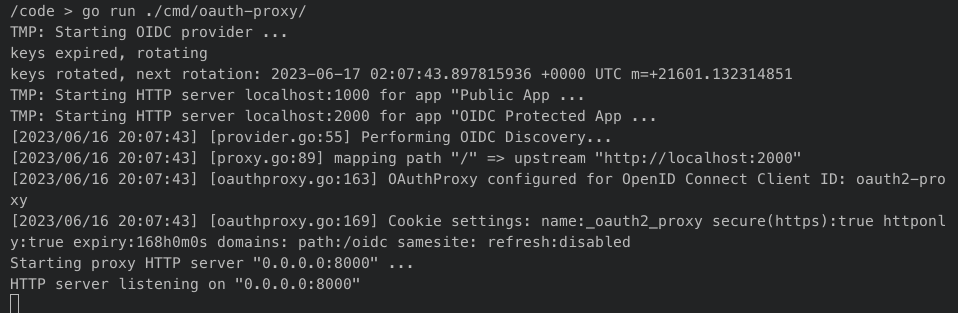
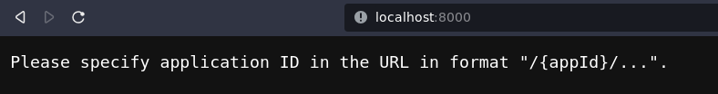
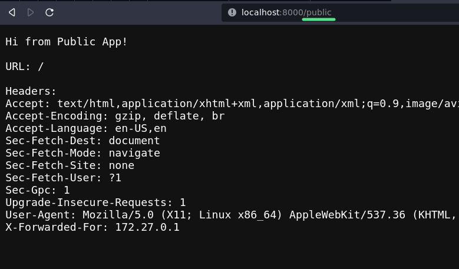
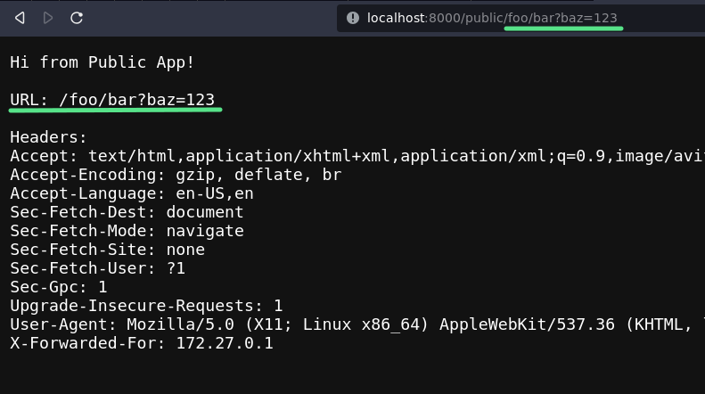
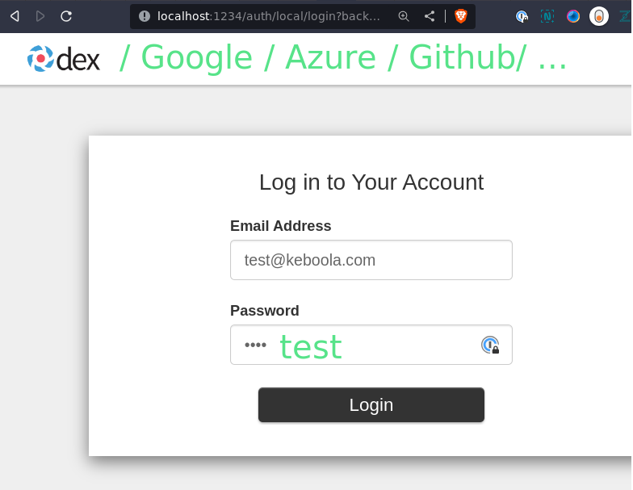
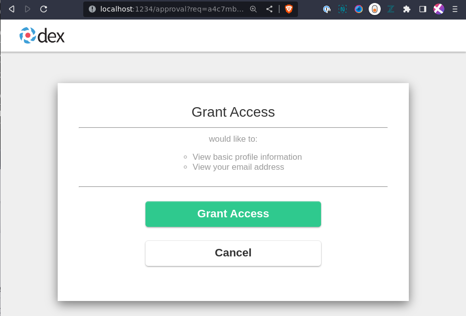
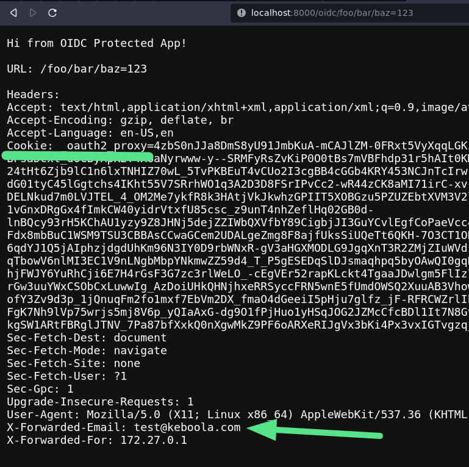
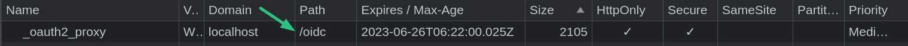

# OAuth2 Proxy PoC

## Mocked Apps

There are two mocked apps in the code:
- `public` without authorization
- `oidc` with OIDC authorization, it is one of the many [available providers](https://oauth2-proxy.github.io/oauth2-proxy/docs/configuration/oauth_provider)

Similar app configurations like these will need to be read via some internal API.

https://github.com/keboola/keboola-as-code/blob/6afe6852f253ffa69a7d39ddb1f2bbd2530ca42d/cmd/oauth-proxy/app.go#L21-L50


A simple HTTP server is started for each app.

https://github.com/keboola/keboola-as-code/blob/6afe6852f253ffa69a7d39ddb1f2bbd2530ca42d/cmd/oauth-proxy/main.go#L64

https://github.com/keboola/keboola-as-code/blob/6afe6852f253ffa69a7d39ddb1f2bbd2530ca42d/cmd/oauth-proxy/util.go#L78-L97

## Mocked OIDC Provider

We need some OIDC provider for the `oidc` app. 

[dexipd/dex](https://github.com/dexidp/dex) is used in this PoC.

https://github.com/keboola/keboola-as-code/blob/6afe6852f253ffa69a7d39ddb1f2bbd2530ca42d/cmd/oauth-proxy/main.go#L49-L52

One user account is set up there:
- Username: `test@keboola.com`
- Password: `test`


## OAuth2 Proxy Fork

Fork: https://github.com/keboola/go-oauth2-proxy

[Small modifications](https://github.com/keboola/go-oauth2-proxy#modifications-in-the-fork) were made to be able to use OAuth2 Proxy as a library. 

It is based on the approach used in the OAuth2 Proxy repo 
"if you want to modify something, fork it" (there are `1.3k` forks of the repo).

## Setup: Clone Repo
```
git clone
git checkout michalljurecko-poc-oauth-proxy
cd keboola-as-code
```

## Run Dev Docker Image
```
docker-compose build
docker-compose run --rm -u "$UID:$GID" -p 8000:8000 -p 1234:1234 dev bash
```

## Build And Run Proxy

```bash
go run ./cmd/oauth-proxy/
```



## HTTP Root

https://github.com/keboola/keboola-as-code/blob/6afe6852f253ffa69a7d39ddb1f2bbd2530ca42d/cmd/oauth-proxy/main.go#L105-L108



## Router

Requests are routed according to the `{appId}` at the beginning of the URL:

https://github.com/keboola/keboola-as-code/blob/6afe6852f253ffa69a7d39ddb1f2bbd2530ca42d/cmd/oauth-proxy/main.go#L110-L119

## App Handler

An HTTP handler is created for each configured app.

https://github.com/keboola/keboola-as-code/blob/6afe6852f253ffa69a7d39ddb1f2bbd2530ca42d/cmd/oauth-proxy/main.go#L132-L139

### Middlewares Chain

There are two middlewares: `wakeUpMiddleware` and `trimAppIDMiddleware`:

https://github.com/keboola/keboola-as-code/blob/6afe6852f253ffa69a7d39ddb1f2bbd2530ca42d/cmd/oauth-proxy/main.go#L133


#### :arrow_right: :arrow_right: :arrow_right: `wakeUpMiddleware`

The `wakeUpMiddleware` simulates starting the app if it has been suspended and waiting for it to start.

The first request is delayed for `5s`, the others proceed without delay.

https://github.com/keboola/keboola-as-code/blob/6afe6852f253ffa69a7d39ddb1f2bbd2530ca42d/cmd/oauth-proxy/main.go#L187-L200

#### `trimAppIDMiddleware`

The `trimAppIDMiddleware` rewrites request URL, it removes `/{appID}` prefix.

https://github.com/keboola/keboola-as-code/blob/6afe6852f253ffa69a7d39ddb1f2bbd2530ca42d/cmd/oauth-proxy/main.go#L168-L185

## Public App

A simple proxy is used for public apps.

https://github.com/keboola/keboola-as-code/blob/6afe6852f253ffa69a7d39ddb1f2bbd2530ca42d/cmd/oauth-proxy/main.go#L141-L147






## OIDC Protected App

:arrow_right: :arrow_right: :arrow_right: An [OAuth2 Proxy](https://github.com/oauth2-proxy/oauth2-proxy) instance is used for protected apps.

The [Middlewares Chain](#middlewares-chain) is connected behind the OAuth2 Proxy.

https://github.com/keboola/keboola-as-code/blob/6afe6852f253ffa69a7d39ddb1f2bbd2530ca42d/cmd/oauth-proxy/main.go#L149-L165

https://github.com/keboola/keboola-as-code/blob/6afe6852f253ffa69a7d39ddb1f2bbd2530ca42d/cmd/oauth-proxy/main.go#L202-L226

### Login in DEX OIDC Provider





### Successful Login

User information can be passed to the app via headers.



## Sing Out

```
http://localhost:8000/{appID}/oauth2/sign_out
```

## Cookies / Security

- The OAuth2 Proxy is configured as stateless.
- All necessary information is stored in cookies.
- The data is encrypted on the server side, the content of the cookies cannot be deciphered on the client side.
- Cookies are separated for individual apps, see `Path`.



## Full Code

https://github.com/keboola/keboola-as-code/tree/michaljurecko-poc-oauth-proxy/cmd/oauth-proxy