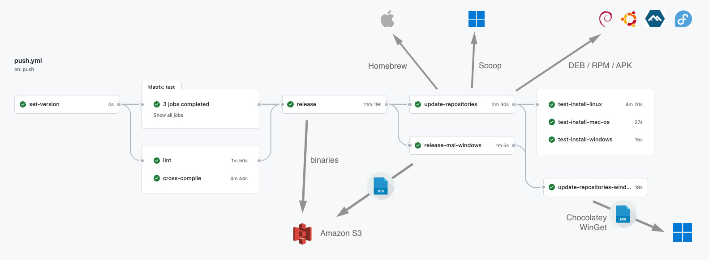
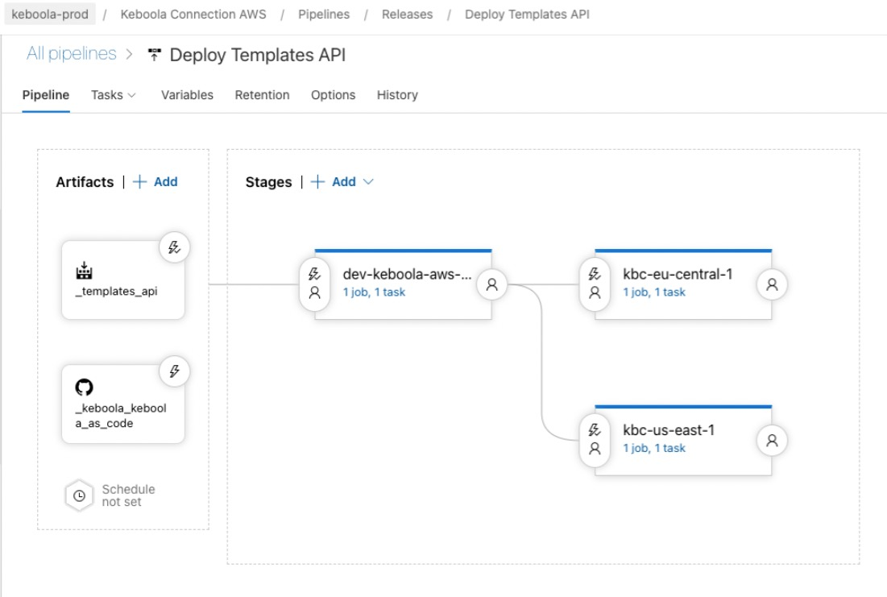

# Keboola as Code - Release Process

The release process is handled by [GitHub Actions workflow](https://github.com/keboola/keboola-as-code/actions) defined
in [.github/workflows/push.yml](../.github/workflows/push.yml) on GitHub release (i.e. on creating a semantic tag 
in the repository).

## Workflow Steps

1. `cross-compile` cross-compiles the binaries
2. `release`
   1. prepares keys for signing linux and macos packages
   2. runs [GoReleaser automation](#goreleaser-automation) which signs the binaries and uploads them to the [distribution S3](#s3-distribution)
   3. uploads compiled (and signed) binaries to the GitHub release files
   4. creates [Homebrew formula](#homebrew)
3. `release-msi-windows`
   1. downloads zipped `amd64` binary from GitHub release
   2. creates [MSI installer](#msi-installer)
   3. uploads the msi file to the [distribution S3](#s3-distribution)
   4. pushes [WinGet manifest](#winget) to its repository index
4. `update-repositories`
   1. pushes [Homebrew formula](#homebrew) to its repository index
   2. pushes [Scoop manifest](#scoop) to its repository index
   3. updates [linux repositories](#linux-repositories)
5. `update-repositories-windows`
   1. pushes [Chocolatey manifest](#chocolatey) to its repository index
   2. pushes [WinGet manifest](#winget) to its repository index
6. `build-and-push-templates-api` (triggered on a tag with `templates-api-v` prefix)
   1. builds the image [Dockerfile-api](../Dockerfile-api)
   2. pushes the image to Amazon ECR repository `keboola/templates-api` under the `ECR Distribution` account
   3. pushes the image to Azure ACR `keboola.azurecr.io/templates-api`
   4. push to the Azure ACR triggers a [release pipeline](#api-release)

## GoReleaser Automation

- [GoReleaser](https://goreleaser.com/) automation defined in [build/ci/goreleaser.yml](../build/ci/goreleaser.yml).
- The `cross-compile` step of the [GitHub Workflow](#workflow-steps) runs `goreleaser build` through `make build` to compile the binaries
- The `release` step of the [GitHub Workflow](#workflow-steps) runs `goreleaser release` through `make release` but the release functionality itself is disabled. The tool just:
  - signs the [macOS binary](#macos) for [Homebrew distribution](#homebrew)
  - creates mainfest for [Scoop](#scoop)
  - uses [GoReleaser publisher](https://goreleaser.com/customization/publishers/) functionality to upload the generated binaries to [distribution S3](#s3-distribution) 

## macOS

- macOS binaries are signed with an Apple Developer code signing certificate
- The certificate is issued by Tomas Netrval's Apple Developer account for the time being
- Packaging and signing of macOS binaries is handled by [gon](https://github.com/mitchellh/gon) from within [build/ci/goreleaser.yml](../build/ci/goreleaser.yml)
- macOS binaries are distributed using [Homebrew distribution](#homebrew)

## Homebrew

- [Homebrew](https://brew.sh/) is a package manager for macOS and Linux
- The manifest is created in the `release` step of the [GitHub Workflow](#workflow-steps)
- The manifest is pushed to the repository in the `update-repositories` step of the [GitHub Workflow](#workflow-steps) 
- We use our own manifest repository located on url https://github.com/keboola/homebrew-keboola-cli

## MSI Installer

- Exe files for Windows distributed through Winget and Chocolatey have to be bundled in installers 
- [MSBuild](https://docs.microsoft.com/en-us/visualstudio/msbuild/msbuild) with [WiX Toolset](https://wixtoolset.org/) is used
- The MSI file is created in the `release-msi-windows` step of the [GitHub Workflow](#workflow-steps)
- The MSI file is uploaded to S3 in the same step

## Chocolatey

- [Chocolatey](https://chocolatey.org/) is a package manager for Windows
- The package is created and pushed to the community repository using `update-repositories-windows` step of the [GitHub Workflow](#workflow-steps)
- The package is published to the community repository: https://community.chocolatey.org/packages/keboola-cli
- Updates to the package are authenticated by API key stored in `CHOCOLATEY_KEY` secret 

## Scoop

- [Scoop](https://scoop.sh/) is a package manager for Windows
- The manifest is created using [build/ci/goreleaser.yml](../build/ci/goreleaser.yml) in the `release` step of the [GitHub Workflow](#workflow-steps)
- The manifest is pushed to the repository in the `update-repositories-windows` step of the [GitHub Workflow](#workflow-steps)
- We use our own manifest repository (bucket) located on url https://github.com/keboola/scoop-keboola-cli

## WinGet

- [WinGet](https://winget.run/) is a package manager for Windows by Microsoft
- The manifest is created using [wingetcreate](https://github.com/microsoft/winget-create) tool and pushed to the repository using `update-repositories-windows` step of the [GitHub Workflow](#workflow-steps)
- The manifest is published to the official repository
- [Initial PR](https://github.com/microsoft/winget-pkgs/pull/47486)

## Linux Repositories

- The `update-repositories` step of the [GitHub Workflow](#workflow-steps) is handling updates to Linux repositories
- Supported packages:
  - [Alpine Linux packages](https://pkgs.alpinelinux.org/packages)
  - [Debian packages](https://packages.debian.org/)
  - [RPM Package Manager](https://rpm.org/)

## S3 Distribution

- The S3 bucket is publicly available on url https://cli-dist.keboola.com
- The bucket belongs to legacy multi-tenant account (147946154733)

## API Release

- `build-and-push-templates-api` step of the [GitHub Workflow](#workflow-steps) builds the API image and pushes it to a repository in AWS and Azure
- push to Azure ACR triggers a release pipeline `TODO`
- 
