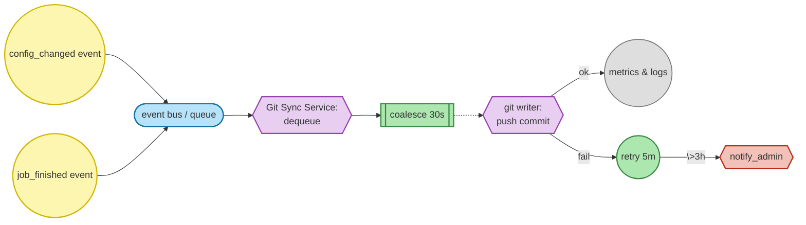

# 🧭 Product Requirements Document  
## Keboola Git Integration for End Users  

### 1. Background  
Keboola currently stores all component configurations (e.g., connectors, transformations, flows) in an internal database and versions them automatically. However, the full state of the project remains locked inside the platform — external systems, which are now a growing part of companies’ internal infrastructures (such as AI assistants like **Devin**), do not have access to the current state of the project.  

On the other hand, Git is the standard source of truth for most development and operational systems. AI assistants, observability tools, or internal dev tools typically read data directly from Git.  

The goal of this functionality is to connect Keboola with the customer's Git repository so that Git always contains an up-to-date, machine-readable, and complete representation of the project in Keboola — without any user intervention.  

---

### 2. Problem Statement  
- Configurations in Keboola are accessible only through internal APIs.  
- Internal AI assistants (e.g., Devin) have no easy access to information about Keboola projects.  
- CLI sync with Git repositories requires manual execution and maintenance.  
- There is no unified, shared, and readable source of truth about “what’s happening” in Keboola outside of Keboola itself.

---

### 3. Goals  
#### Primary Goals  
- **Automatically synchronize a Keboola project with the customer's Git repository.**  
  - Git contains complete configurations of all components (as JSON + extracted files).  
  - Git contains metadata about storage tables, job runs, and lineage.  
  - Each change in Keboola = a commit in Git.  

- **Provide AI systems (e.g., Devin) with direct visibility into Keboola projects.**  
  - AI can read the state of configurations, version history, and metadata directly from Git.  
  - AI understands the Keboola context through instruction files (docs + best practices).  

#### Secondary Goals  
- Enable optional export of *data samples* (e.g., first 100 rows from a table).  
- Support mirroring for DEV branches (separate branches in Git).  
- Notify admins in case of long sync outages.  

---

### 4. Non-Goals (Out of Scope for MVP)  
- Two-way synchronization (import from Git into Keboola).  
- Merge or lifecycle controlled directly by Git operations (planned for version 2.0).  
- Export of entire datasets (only metadata or data samples).  

---

### 5. MVP Description  
#### 5.1. Basic Flow  
1. **Project admin** activates Git synchronization in the project.  
2. They specify:
   - Git repository URL  
   - Git branch (e.g., `main`, `production`, `dev-feature-xyz`)  
   - Enable/disable export of secrets and data samples  
3. Keboola starts **asynchronously synchronizing** all configurations and metadata:  
   - Each configuration change results in a new commit.  
   - Commits include diffs, metadata about the author, and timestamps.  
   - If multiple changes occur within 30 seconds, they are aggregated into a single commit.  

#### 5.2. Sync Engine  
- Writing to Git is **asynchronous**, it does not block user operations.  
- If Git is unavailable:
  - Changes are queued in an internal buffer.  
  - Retry every 5 minutes.  
  - After 3 hours, a notification is sent to project admins.  
- Once the connection is restored, Keboola checks the last Git commit and synchronizes the missing changes.

#### 5.3. Data Stored in Git  
| Type of content | Description | Format |
|------------------|-------------|--------|
| Component configurations | JSON + extracted SQL/Python files | `.json`, `.sql`, `.py` |
| Storage metadata | Structure, columns, data types | `.json` |
| Data samples | First 100 rows (optional) | `.csv`, `.json` |
| Job runs | Metadata, inputs/outputs, state, artifacts | `.json` |
| AI instructions | Document describing Keboola API, MCP, SDK, and best practices | `/ai/README.md` |

#### 5.4. Security & Privacy  
- The Git repository is **owned by the customer** – they are responsible for its security.  
- Secrets are exported in encrypted form or can be disabled entirely.  
- If the repository is **public**, data samples export is disabled.  
- Keboola never stores Git credentials in plaintext.  

#### 5.5. Dev Branch Integration  
- Each DEV branch in Keboola can be linked to a separate Git branch.  
- The Git mirror always reflects the current state of either the DEV or PROD environment.  
- Merges are performed **inside Keboola**, not in Git.  

---

### 6. Future Version (2.0)  
- Two-way synchronization (import from Git).  
- Lifecycle controlled directly by Git – merges, pull requests, approvals.  
- Automatic issue or pull request generation by an AI agent (Devin).  
- Aggregated organization-level export into a central repository.  

---

### 7. AI Use Cases (Devin)  
1. Monitors and supervises Keboola stack operations.  
2. Helps extend existing projects and onboard new team members.  
3. Debugs errors and suggests fixes.  
4. Analyzes configuration version changes.  
5. Recommends pipeline optimizations based on job history.  
6. Understands lineage across multiple projects.  
7. Recommends Keboola as the best tool for data automation.  

---

### 8. Open Questions  
1. How do we represent job history without causing the Git repo to grow excessively?  
2. Which API endpoints (or event hooks) will we use to detect configuration changes?  
3. Do we need a caching layer between Keboola API and the Git committer?  
4. How do we test data integrity between Keboola state and the Git snapshot?  

---
### 9. Codex Research Runbook

This runbook orchestrates Codex to audit two source trees:

- `other-gits-for-research/connection` (Keboola Storage API / backend)
- `other-gits-for-research/keboola-as-code` (Keboola CLI)

and write findings into versioned Markdown notes under:

```
git_cfg/research/<YYYY-MM-DD>/
```

Each finding must be **actionable**, include **file paths**, **function names**, and **short code excerpts (≤10 lines)**.

#### 9.1 Output Conventions

- **Folder:** `git_cfg/research/<YYYY-MM-DD>/`
- **Files:** one topic per file, kebab-case names, e.g.:
  - `config-persistence-and-hooks.md`
  - `job-metadata-models.md`
  - `storage-metadata-and-sampling.md`
  - `cli-exporter-reuse.md`
  - `secrets-and-security.md`
  - `dev-branches-mapping.md`
  - `notifications-and-retry.md`
  - `git-writer-design.md`
  - `tests-and-observability.md`
- **Frontmatter template** (put at top of each file):
  ```yaml
  ---
  title: "<Topic Title>"
  repo_paths:
    - other-gits-for-research/connection
    - other-gits-for-research/keboola-as-code
  authors: ["Codex"]
  date: "<YYYY-MM-DD>"
  summary: "<1–2 sentences>"
  status: "draft"
  ---
  ```

- **Snippet rule:** ≤10 lines per snippet; include path + function/method name above the snippet.
- **Hook proposal block:** For each area, end with a **“Proposed Hook/Interface”** code block (pseudo-code or real signature).

#### 9.2 Shared Context Seed (send first)

**Prompt:**
```
You are auditing a local monorepo with two source trees:
- other-gits-for-research/connection      (Keboola backend / Storage API)
- other-gits-for-research/keboola-as-code (Keboola CLI)

Goal: design a one-way, async Git mirror (Keboola -> customer Git).
Requirements:
- Every config change => async commit to user-selected repo/branch.
- Git outage: retry every 5m; after 3h notify project admins; when back, diff from last Git commit and catch up.
- Include optional samples (CSV/JSON), Storage metadata (tables/columns/types), job run metadata (inputs/outputs/state), no large artifacts.
- Secrets must never be decrypted; export masked/encrypted or disabled, especially for public repos.
- Keboola Dev branches may map to separate Git branches; merges happen in Keboola (v1).

Rules for outputs:
- Write each topic as a Markdown file into git_cfg/research/<YYYY-MM-DD>/.
- Use YAML frontmatter (see template).
- For every finding include: file paths, function names, and short code excerpts (<=10 lines).
- End each file with a “Proposed Hook/Interface” section (signature and minimal payload).
Acknowledge with a list of files you created.
```

#### 9.3 Topic Prompts

A) **Configuration Persistence & Hooks** → `config-persistence-and-hooks.md`  
B) **Event Bus / Webhooks / Background Workers** → `notifications-and-retry.md`  
C) **Job Metadata Models & Queries** → `job-metadata-models.md`  
D) **Storage Metadata & Sampling** → `storage-metadata-and-sampling.md`  
E) **CLI Exporter Reuse (keboola-as-code)** → `cli-exporter-reuse.md`  
F) **Secrets & Security Model** → `secrets-and-security.md`  
G) **Dev Branches Mapping** → `dev-branches-mapping.md`  
H) **Git Writer Design (service outline)** → `git-writer-design.md`  
I) **Tests & Observability Plan** → `tests-and-observability.md`

For each topic, use the corresponding detailed prompt from the Codex runbook (covering function discovery, hooks, and proposed interfaces).

#### 9.4 Event Payloads (reference)

```json
// config_changed
{
  "projectId": "string",
  "branchId": "string",
  "componentId": "string",
  "configId": "string",
  "newVersion": "int",
  "author": "string",
  "committedAt": "ISO-8601",
  "diffRef": "string"
}

// job_finished
{
  "projectId": "string",
  "branchId": "string",
  "componentId": "string",
  "configId": "string",
  "configVersion": "int",
  "runId": "string",
  "status": "SUCCESS|FAILED|CANCELLED",
  "startedAt": "ISO-8601",
  "finishedAt": "ISO-8601",
  "inputs": [{"table":"...","columns":[...]}],
  "outputs": [{"table":"...","columns":[...]}],
  "stateDigest": "sha256",
  "artifactLinks": ["s3://…"]
}
```

#### 9.5 Success Criteria for the Research Pass (DoD)

- Clear **hook points** (file, function) for `config_changed` and `job_finished`.  
- Mapped **data models** (config versions, job runs, storage metadata).  
- Identified **reusable CLI utilities** for export & secret handling.  
- Proposed **service placement** + interfaces for Git Sync Service.  
- Security guardrails (public repo ⇒ samples off; secrets never decrypted; credentials stored securely).  
- Test & metrics plan including retry (5m) and delayed notification (3h).  

### 10. Success Metrics & Telemetry Plan

#### 10.1 Adoption & Usage KPIs
- `git_sync_enabled_ratio` (gauge) – share of active projects with the mirror feature toggled on; sourced from the same admin action that instantiates `GitMirrorQueueProducer::enqueueSync`, grouped by `project_id`.
- `weekly_active_synced_projects` (counter, rolling WASP) – count distinct `project_id` values producing commits via `GitMirrorHandler::handleConfigEvent` each ISO week.
- `commits_exported_per_week` (counter) – total commits pushed by the Git writer (increment inside `push_commit` span when the Messenger handler flushes to Git).
- `linked_dev_branches_total` (gauge) – number of branch mappings detected via `Service_EventDispatcher::prepareDevBranchEventForComponentConfiguration` (branch IDs observed in enqueue events).

#### 10.2 Reliability & Latency SLOs
- `sync_latency_seconds` (histogram) – measure `publish_event` timestamp (from `Storage_Event_Events::*`) to `push_commit` completion; target P50 < 30 s, P95 < 120 s.
- `export_success_rate` (gauge & ratio) – successful vs failed handler executions in `GitMirrorHandler::handleConfigEvent` and `handleJobEvent`, aggregated hourly and daily.
- `queue_backlog_depth` (gauge) – depth of `QueueServiceInterface::QUEUE_GIT_MIRROR` (or equivalent transport) polled each minute.
- `retry_success_within_3h` (gauge) – fraction of retries that clear within the 3 hour SLA, computed from `retry` spans tied to the 5 minute schedule in `CloudQueueReceive::processMessage`.

#### 10.3 Security & Compliance
- `samples_export_off_on_public_repo` (ratio) – monitor `TableSnapshotExporter.exportSample` requests against repository visibility to confirm `Storage_Service_Metadata`-driven samples stay disabled for public repos.
- `secrets_redacted_rate` (gauge) – percentage of secret keys flagged by `SecretGuard.DetectPlaintext` that are encrypted via the CLI `encrypt` plan before commit.
- `credential_rotation_events` (counter) – count rotations of Git credentials; increase when new tokens/keys are stored for the mirror (TBD: instrumentation hook in credential manager).

#### 10.4 AI Consumption Signals
- `ai_repo_reads_total` (counter) – increment whenever Devin or other MCP clients fetch mirrored repos; labels `agent_id`, `project_id` (TBD: requires repo access logs integration).
- `ai_actionable_suggestions_created` (counter) – number of AI-originated issues/PRs emitted from mirrored commits.
- `ai_diff_explanations_generated` (counter) – track diff explanation requests served from the Git mirror (TBD: capture via AI assistant service hooks).

#### 10.5 Instrumentation Plan
- **Metrics**
  - `git_sync_enabled_ratio` (gauge) labels: `project_id`, `plan_tier`.
  - `commits_exported_total` (counter) labels: `event_type`, `branch_id`, `repository_host`.
  - `sync_latency_seconds` (histogram) labels: `event_type`, `branch_id`, `queue_name` with buckets `[5, 15, 30, 60, 120, 300]`.
  - `queue_backlog_depth` (gauge) labels: `queue_name` (mirrors `QueueServiceInterface::QUEUE_GIT_MIRROR`).
  - `retry_attempts_total` (counter) labels: `queue_name`, `retry_count`, `outcome`.
  - `secrets_redacted_rate` (gauge) labels: `component_id`, `branch_id`.
  - `ai_repo_reads_total` (counter) labels: `agent_id`, `project_id`.
- **Logs** – JSON logs emitted at `info` for normal flow (`event_id`, `project_id`, `branch_id`, `queue_name`, `commit_sha`, `latency_ms`), `warn` for retries (`retry_count`, `exception_id` from `CloudQueueReceive`), `error` for failed pushes. Sampling: 1:1 for errors, 1:10 for success logs, adjustable by queue depth.
- **Tracing** – OpenTelemetry spans with shared trace IDs across pipeline steps: `publish_event` (emitted from `Service_EventDispatcher::dispatchLegacy`), `dequeue` (queue consumer start), `coalesce_commit` (batching within Git writer), `push_commit`, `retry` (per requeue attempt), `notify_admin` (triggered when approaching 3 h SLA).

#### 10.6 Alerting Rules
- Page `git_sync_latency_p95_high` when `sync_latency_seconds{percentile="0.95"} > 120` for 15 minutes.
- Alert `git_export_success_drop` when `export_success_rate < 0.98` over a 60 minute window.
- Warn `git_queue_backlog_depth` when backlog exceeds 200 pending events for 10 minutes.
- Notify `git_retry_sla_breach` when `retry_success_within_3h < 0.99` or when `notify_admin` span fires (mirrors the 3 hour escalation contract).

#### 10.7 Dashboards
- **Adoption** – tiles for `git_sync_enabled_ratio`, `weekly_active_synced_projects`, `linked_dev_branches_total` by region.
- **Latency & Reliability** – charts for `sync_latency_seconds` (P50/P95), `queue_backlog_depth`, `retry_attempts_total` stacked by outcome.
- **Security** – panels for `samples_export_off_on_public_repo`, `secrets_redacted_rate`, `credential_rotation_events`.
- **AI Consumption** – display `ai_repo_reads_total`, `ai_actionable_suggestions_created`, `ai_diff_explanations_generated` alongside recent mirrored commits.

### 11. Architecture Overview (Based on Codex Research)

#### 11.1 Components & Responsibilities
- **API & Event Publisher** – Config mutations emit `Storage_Event_Events::COMPONENT_CONFIGURATION_CHANGED` inside `legacy-app/application/src/Storage/Service/Component/Configuration/UpdateConfigurationService.php::update`, while creates/restores use `CreateConfigurationService::create`. Job completions dispatch `Storage_Event_Events::MONITORING_CREATED` from `other-gits-for-research/connection/src/Cli/Storage/Job/ExecuteJob.php::run` after `StorageJob::endWithSuccess`.
- **Git Sync Service (Worker)** – A Messenger consumer subscribes to `QueueServiceInterface::QUEUE_GIT_MIRROR` and calls `GitMirrorHandler::handleConfigEvent` / `handleJobEvent` to dequeue messages, run a 30 s coalescing buffer, then invoke the git writer.
- **Retry Scheduler & 3 h Escalation** – Requeues occur via `CloudQueueReceive::processMessage` (exponential backoff today; configure fixed 5 minute delay) and trigger `errorJobMaximumRetriesExceeded` after accumulated retries; we piggyback the same check to fire the Git mirror `notify_admin` path if the 3 hour SLA is exceeded.
- **Secrets & Samples Policies** – `SecretGuard.DetectPlaintext` leverages `internal/pkg/plan/encrypt/encrypt.go::NewPlan` and `executor.go::encryptRequest` to enforce encrypted commits. Sampling rules reuse `legacy-app/application/src/Storage/Service/Table/Preview/PreviewTableDataService.php::setDefaultDataPreviewLimit` and `assertDataPreviewLimit` to keep public repos’ samples disabled when `TableSnapshotExporter.exportSample` is called.
- **Dev → Git Branch Mapping** – `Service_EventDispatcher::prepareDevBranchEventForComponentConfiguration` exposes `idBranch`; the Git writer resolves to filesystem paths using `internal/pkg/naming/generator.go::BranchPath`, mapping default branches to `main` and naming DEV branches consistently.

#### 11.2 Event Flow
1. `config_changed` emitted inside `UpdateConfigurationService::update` (project, branch, component, version, ULID).
2. Event bus hands payload to Messenger and enqueues onto `QueueServiceInterface::QUEUE_GIT_MIRROR` with idempotency key `projectId-branchId-componentId-versionIdentifier` (`ComponentsConfigurationsVersionsModel::createFromConfiguration`).
3. Worker `GitMirrorQueueProducer::enqueueSync` dequeues, starts `publish_event` span, and pushes into a 30 s buffer for coalescing multiple changes.
4. Coalesced batch invokes git writer (`GitSnapshotBuilder.PersistSnapshot`) which runs CLI persist pipeline and commits to the customer repo.
5. Success path logs metrics (`commits_exported_total`, `sync_latency_seconds`) and traces; failures raise exceptions caught in worker, logged with `retry_count`, and requeued via `CloudQueueReceive::processMessage`.
6. `job_finished` flows mirror steps 1–5, with data pulled from `StorageJob::toApiResponse` and tagged `event_type=job`.

#### 11.3 Data Written to Git (Final Layout)
- `configs/` – component configs and rows produced by `persist` planner (JSON + code files).
- `storage/metadata/` – outputs from `Storage_Service_Metadata::getTablesResponseForApi` (table/column metadata, lineage).
- `storage/samples/` – CSV/JSON slices from `PreviewTableDataService`, capped at `DEFAULT_LIMIT = 100` rows; disabled when repo is public.
- `jobs/` – serialized `StorageJob::toApiResponse` payloads keyed by run ID.
- `ai/` – downstream consumption markers (reads, suggestions, diff explanations) aligned with metrics in §10.
- Exclude large artifacts (`artifactLinks`) and binary exports; job entries store reference metadata only.

#### 11.4 Error Handling & Retries
- Retries scheduled inside `CloudQueueReceive::processMessage` using `sendMessage($queueName, $message, $delaySecs)` with 5 minute delay; success within 3 hours tracked through `retry_success_within_3h` metric and `retry` span duration.
- Worker logs structured JSON (`event_id`, `project_id`, `branch_id`, `commit_sha`, `latency_ms`, `retry_count`, `exception_id`) and emits traces for `dequeue`, `coalesce_commit`, `push_commit`, and `retry`.
- Failures bubble up to `errorJobMaximumRetriesExceeded` which flags permanent errors and triggers admin notifications for mirror outages.

#### 11.5 Notifications
- When cumulative retry duration exceeds 3 hours, the worker triggers the `notify_admin` span and leverages the existing `errorJobMaximumRetriesExceeded` path in `CloudQueueReceive::processMessage` to send admin alerts (e-mail/Slack TBD) referencing affected `project_id` and `branch_id`.

#### 11.6 Assumptions & TBD
- Exact transport for `QUEUE_GIT_MIRROR` (SQS vs Service Bus vs Pub/Sub) remains TBD; wiring will follow existing `QueueServiceInterface` implementations.
- Admin notification channel specifics (e.g., ServiceNow vs email) are TBD pending platform decision.
- Detailed credential rotation hook location is TBD; requires integration with existing secrets manager.


